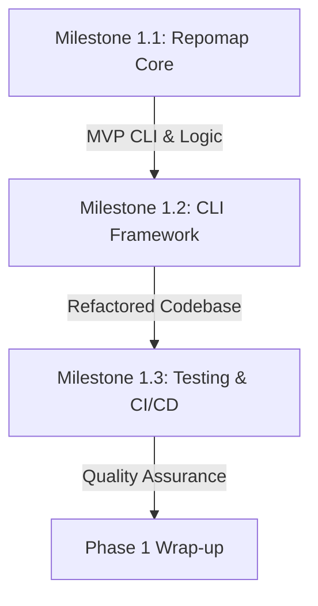

# Agents-CLI: Development Plan

## Executive Summary

This document outlines the **complete development plan** for **agents-cli**—a suite of specialized tools that enable LLM agents to understand, navigate, and manipulate large codebases and systems efficiently.

**Phase 1 (Weeks 1–6)** establishes the foundation with the **repomap** MVP tool, a reusable CLI framework, and comprehensive testing infrastructure.

---

## Vision

Traditional agent tools (curl, ls, find, grep) were designed for human interaction. **agents-cli** tools are designed for agents:

- **High-density information:** Compressed, structured output (JSON/XML) rather than human-readable streams
- **Semantic understanding:** Tools like semantic grep that understand code meaning, not just syntax
- **Safety rails:** Sandboxed execution, validated APIs, structured error handling
- **Token-efficient:** Optimized for LLM context windows

---

## Phase 1: Foundation & MVP

**Duration:** 4–6 weeks  
**Outcome:** Production-ready repomap tool + reusable CLI framework + testing infrastructure

### Milestone 1.1: Repomap Core Implementation
Deliver the primary MVP—a tool that analyzes Go repositories and generates token-optimized, high-density maps.

**Key Features:**
- Fast file discovery with `.gitignore` support
- Go AST parsing for definitions and imports
- Import graph construction and importance ranking
- XML/JSON output with token budgeting
- Command-line interface with standard flags

**Duration:** 2–3 weeks  
**Tasks:** 19  
**Target Coverage:** >85%

👉 [Read Milestone 1.1 README](Phase-1-Foundation-MVP/Milestone-1.1-Repomap-Core/README.md)

---

### Milestone 1.2: CLI Framework & Integration
Extract reusable patterns from repomap to create a shared framework for all future tools.

**Key Components:**
- CLI flag parsing and validation
- Output formatters (XML, JSON, text/table)
- Configuration management (files, env vars, CLI flags)
- Error handling and utilities
- Refactored repomap using the framework

**Duration:** 1 week  
**Tasks:** 22  
**Target Coverage:** >80%

👉 [Read Milestone 1.2 README](Phase-1-Foundation-MVP/Milestone-1.2-CLI-Framework/README.md)

---

### Milestone 1.3: Testing Infrastructure & CI/CD
Establish comprehensive testing, performance benchmarking, and continuous integration.

**Key Deliverables:**
- Unit tests (>85% coverage)
- Integration tests on real Go repositories
- Performance benchmarks and baselines
- GitHub Actions CI/CD workflows
- Documentation (TESTING.md, BENCHMARKING.md, CI_CD.md)

**Duration:** 1 week  
**Tasks:** 27  
**Target Coverage:** >85% all packages

👉 [Read Milestone 1.3 README](Phase-1-Foundation-MVP/Milestone-1.3-Testing-Infrastructure/README.md)

---

## Phase 1 Success Criteria

✅ **Phase 1 is COMPLETE when:**

1. **Repomap Tool**
   - Binary compiles and runs on Go 1.19+
   - Correctly discovers, parses, ranks, and outputs Go repositories
   - Respects `.gitignore` and token budgets
   - Processes 10K files in <30 seconds

2. **CLI Framework**
   - Reusable by multiple tools
   - Supports flags, output formats, config hierarchy, error handling
   - Zero breaking changes to repomap interface
   - >80% code coverage

3. **Testing & CI/CD**
   - >85% code coverage on all packages
   - 100% test pass rate locally and in CI
   - GitHub Actions workflows operational
   - Binary releases created and published

4. **Documentation**
   - User guides (QUICK_START.md, CLI_REFERENCE.md)
   - Architecture documentation (in repomap/doc/)
   - Testing procedures (TESTING.md)
   - Framework guide for tool developers (FRAMEWORK_GUIDE.md)

---

## Phase 2: Multi-Language & Semantic Tools (Future)

Building on Phase 1's foundation:

- **Multi-language support:** Tree-sitter integration for Python, JavaScript, Rust, etc.
- **Semantic grep:** `semgrep-cli` for semantic code search using embeddings
- **Web navigation:** `web-ray` for structured web page analysis
- **Extended testing** for new tools

---

## Phase 3: Advanced Tooling (Future)

Expanding the agent toolkit:

- **Sandboxed execution:** `sandbox-run` for safe command execution
- **API integration:** `api-forge` for intelligent API interaction
- **Git operations:** `git-surgeon` for conflict resolution
- **Memory management:** `mem-kv` for long-term context storage
- **Math processing:** `calc-bridge` for symbolic computation

---

## Phase 4: Integration & Deployment (Future)

Enterprise-grade features:

- **Server mode** for distributed access
- **Authentication & authorization**
- **Monitoring & observability**
- **Cloud deployment** templates

---

## Project Structure

```
agents-cli/
├── PLAN/                                    # This document
│   └── Phase-1-Foundation-MVP/
│       ├── README.md                        # Phase overview
│       ├── Milestone-1.1-Repomap-Core/
│       │   ├── README.md
│       │   ├── tasks.md
│       │   ├── prd.json
│       │   ├── Progress.md
│       │   └── summary.md
│       ├── Milestone-1.2-CLI-Framework/
│       │   ├── README.md
│       │   ├── tasks.md
│       │   ├── prd.json
│       │   ├── Progress.md
│       │   └── summary.md
│       └── Milestone-1.3-Testing-Infrastructure/
│           ├── README.md
│           ├── tasks.md
│           ├── prd.json
│           ├── Progress.md
│           └── summary.md
├── repomap/                                 # Repomap tool
│   ├── cmd/repomap/
│   │   └── main.go
│   ├── internal/
│   │   ├── discovery/
│   │   ├── parsing/
│   │   ├── graph/
│   │   ├── ranking/
│   │   └── output/
│   ├── repomap/
│   │   └── repomap.go                      # Public API
│   ├── go.mod
│   ├── go.sum
│   └── doc/                                # (Already created)
│       ├── ARCHITECTURE.md
│       ├── DATA_STRUCTURES.md
│       ├── LIBRARIES.md
│       ├── LOGIC_FLOW.md
│       ├── IMPLEMENTATION_STRATEGY.md
│       ├── QUICK_START.md
│       ├── EXAMPLES.md
│       ├── CLI_REFERENCE.md
│       └── COMMANDS.md
├── pkg/                                     # Shared packages (created in 1.2)
│   ├── cli/
│   ├── output/
│   ├── config/
│   ├── errors/
│   └── util/
├── test/                                    # Integration tests (created in 1.3)
│   ├── fixtures/
│   ├── integration_test.go
│   └── benchmarks_test.go
├── .github/
│   ├── prompts/
│   │   ├── phase-N-milestone.prompt.md     # Milestone creation instructions
│   │   └── execute.prompt.md
│   └── workflows/                           # GitHub Actions (created in 1.3)
│       ├── test.yml
│       ├── build.yml
│       ├── release.yml
│       └── coverage.yml
├── roadmad.md                               # Project vision
└── README.md                                # Main project README
```

---

## Phase 1 Lifecycle & Dependencies

Phase 1 follows a strictly sequential path where each milestone builds on the previous one's output.

### Dependency Graph

```text
[M1.1: Repomap Core]
       │
       ▼
[M1.2: CLI Framework] ───┐
       │                 │ (Used by)
       ▼                 ▼
[M1.3: Testing & CI/CD] ◄[Final Phase 1 Release]
```

### Detailed Prerequisites

| Milestone | Prerequisite | Output for Next Phase |
|-----------|--------------|------------------------|
| **1.1 Repomap Core** | None (Initial Foundation) | Working prototype + MVP CLI logic |
| **1.2 CLI Framework** | M1.1 (CLI & Output logic) | Reusable `pkg/` library + Refactored Repomap |
| **1.3 Testing & CI/CD** | M1.1 & M1.2 (All code) | Automated QA + Multi-platform Artifacts |

---

## Timeline Summary



```
Week 1–3:   Milestone 1.1 (Repomap Core)
  ├─ Week 1: Discovery + Parsing
  ├─ Week 2: Graph + Ranking
  └─ Week 3: Output + CLI + Basic Testing

Week 4:     Milestone 1.2 (CLI Framework)
  └─ DEPENDENCY: Needs M1.1 CLI/Output logic
  └─ Extraction, refactoring, tool integration

Week 5:     Milestone 1.3 (Testing)
  └─ DEPENDENCY: Needs M1.1 & M1.2 code complete
  ├─ Unit/Integration/Performance Tests
  └─ CI/CD setup

Week 6:     Phase 1 Wrap-up
  ├─ Final documentation
  ├─ Release binaries
  └─ Prepare for Phase 2
```

**Total Duration:** 4–6 weeks

---

## Technology Stack

### Phase 1
- **Language:** Go 1.19+
- **Parsing:** `go/ast` (standard library)
- **File Walking:** `filepath.WalkDir` or `filepath.Walk`
- **Testing:** `testing` package (standard library)
- **CI/CD:** GitHub Actions
- **Distribution:** Single-file Go binaries

### Phase 2+ (Future)
- **Multi-language Parsing:** Tree-sitter (`go-tree-sitter`)
- **Embeddings:** Lightweight models (e.g., `all-MiniLM-L6-v2`)
- **Web Automation:** Playwright/Puppeteer
- **Sandboxing:** Docker or Firecracker

---

## Dependencies

### External
- Go 1.19+ compiler
- GitHub (for Actions)
- Git (for version control)
- Standard libraries only (no external packages in Phase 1)

### Internal
- repomap/doc/ (documentation—already created)
- PLAN/ (this development plan)

---

## Success Metrics

| Milestone | Target | Status |
|-----------|--------|--------|
| 1.1 Repomap Core | 19 tasks, >85% coverage, <30s on 10K files | Not Started |
| 1.2 CLI Framework | 22 tasks, >80% coverage, reusable by 2+ tools | Not Started |
| 1.3 Testing | 27 tasks, >85% coverage, CI/CD operational | Not Started |
| **Phase 1 Total** | **68 tasks, all tests passing** | **Not Started** |

---

## Risk Register

| Risk | Likelihood | Impact | Mitigation |
|------|------------|--------|-----------|
| Large repos timeout | Medium | High | Limit Phase 1 to 100K files; optimize in Phase 2 |
| Complex patterns | Low | Medium | Start simple; use library if needed |
| Framework over-engineering | Medium | Medium | Keep it simple; design for extensibility |
| Test coverage gaps | Low | Low | Focus on critical paths; use tools to identify gaps |
| CI/CD complexity | Medium | Medium | Start simple; iterate based on needs |

---

## Open Questions & Decisions

1. **Q: Should we use external libraries for gitignore parsing?**
   - **A:** Start simple in Phase 1; switch to `monochromegane/go-gitignore` if complexity grows

2. **Q: What's the max repository size for Phase 1?**
   - **A:** 100K files; larger repos deferred to Phase 2 with optimization

3. **Q: Should we support non-Go languages in Phase 1?**
   - **A:** No; Go-only in Phase 1; Tree-sitter integration in Phase 2

4. **Q: Which CI/CD platform?**
   - **A:** GitHub Actions (built-in, free for public repos, no separate account)

---

## How to Use This Plan

### For Project Leads
1. Review Phase 1 timeline and success criteria
2. Monitor milestone progress weekly
3. Adjust timeline based on actual velocity
4. Plan Phase 2 once Phase 1 is 80% complete

### For Developers
1. Start with [Milestone 1.1 README](Phase-1-Foundation-MVP/Milestone-1.1-Repomap-Core/README.md)
2. Read [tasks.md](Phase-1-Foundation-MVP/Milestone-1.1-Repomap-Core/tasks.md) for detailed work
3. Reference [implementation strategy](PLAN/Phase-1-Foundation-MVP/Milestone-1.1-Repomap-Core/) for design
4. Follow [CONTRIBUTING.md](repomap/CONTRIBUTING.md) for code standards

### For QA/Testing
1. Review [Milestone 1.3](Phase-1-Foundation-MVP/Milestone-1.3-Testing-Infrastructure/README.md) for testing strategy
2. Set up test fixtures using [test/fixtures/](test/fixtures/)
3. Monitor coverage using [TESTING.md](TESTING.md)
4. Run benchmarks using [BENCHMARKING.md](BENCHMARKING.md)

---

## Navigation

- [Phase 1 Overview](Phase-1-Foundation-MVP/README.md)
- [Milestone 1.1: Repomap Core](Phase-1-Foundation-MVP/Milestone-1.1-Repomap-Core/README.md)
- [Milestone 1.2: CLI Framework](Phase-1-Foundation-MVP/Milestone-1.2-CLI-Framework/README.md)
- [Milestone 1.3: Testing Infrastructure](Phase-1-Foundation-MVP/Milestone-1.3-Testing-Infrastructure/README.md)
- [Project Vision (roadmad.md)](../roadmad.md)
- [Repomap Documentation](../repomap/doc/)

---

## Document History

| Version | Date | Author | Notes |
|---------|------|--------|-------|
| 1.0 | 2026-02-09 | AI Assistant | Initial plan created following phase-N-milestone.prompt.md |

---

## Approval & Sign-Off

**Status:** Ready for Review

- [ ] Project Lead Approval
- [ ] Technical Lead Review
- [ ] Team Consensus

---

## Next Steps

1. **Review:** Share this plan with team and stakeholders
2. **Approve:** Get sign-off on timeline and scope
3. **Kickoff:** Begin Milestone 1.1
4. **Track:** Update progress weekly
5. **Iterate:** Adjust plan based on learnings

---

*Last Updated: 2026-02-09*
